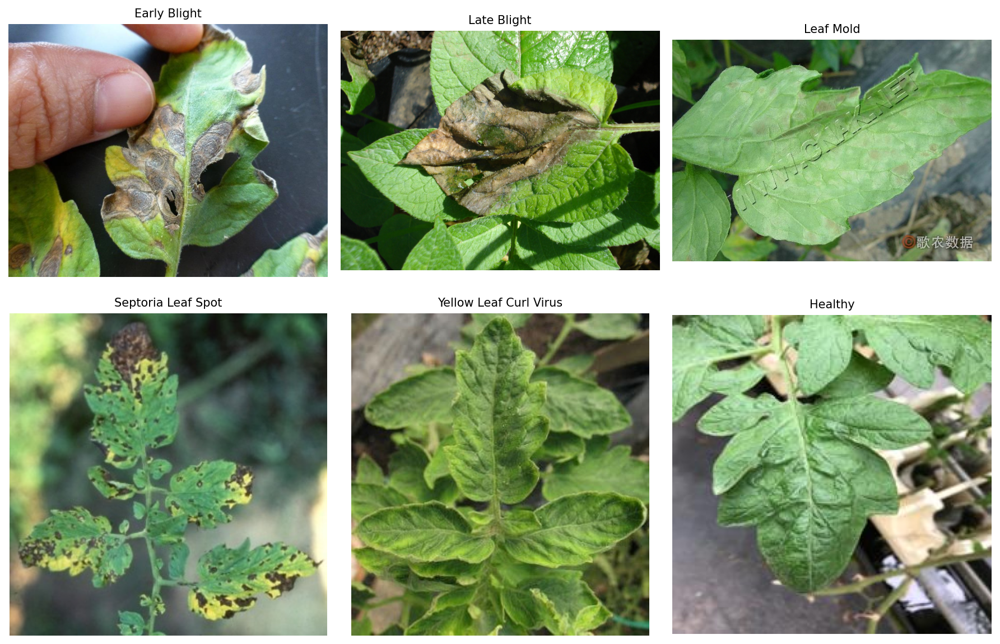
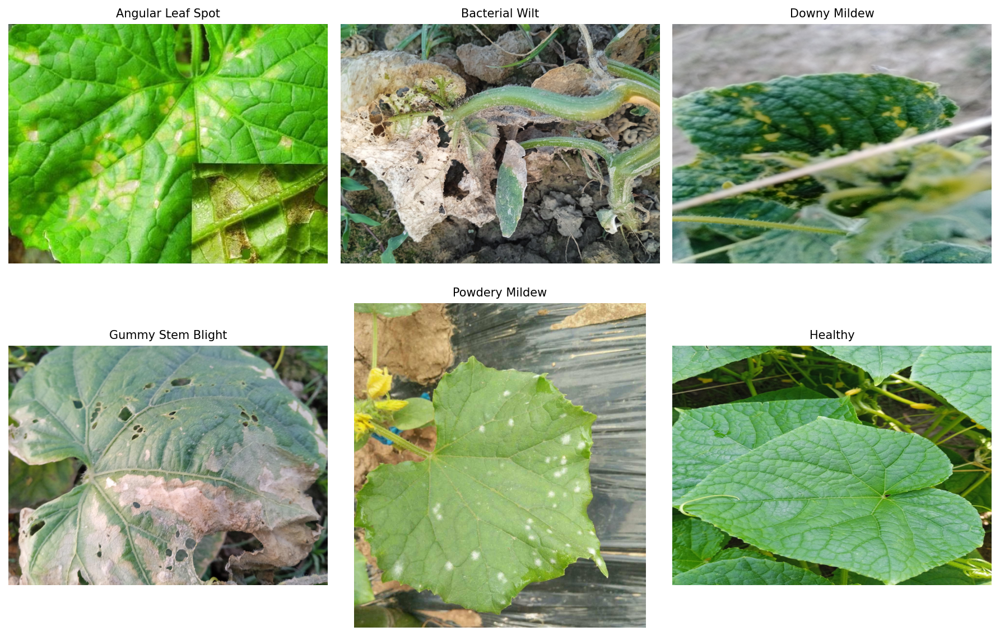

## 🔗 Ссылки на датасеты  

### Томаты  
- **Источники**:
  - [PlantWild_v2](https://tqwei05.github.io/PlantWild/) (подмножество)  
  - [Taiwan Tomato Dataset](https://data.mendeley.com/datasets/ngdgg79rzb/1)  
- **Скачать подготовленный датасет (Google Drive)**:  
  [tomato_dataset.zip](https://drive.google.com/file/d/1mJUS9ioPTEaBWlcY0wpXCvNNB_F7PPbL/view?usp=drive_link)  
### Огурцы  
- **Источники**:  
  - [PlantWild_v2](https://tqwei05.github.io/PlantWild/) (подмножество)  
  - [CDRD (Cucumber Disease Recognition Dataset)](https://www.sciencedirect.com/science/article/pii/S2352340923004389)  
- **Скачать подготовленный датасет (Google Drive)**:  
  [cucumber_dataset.zip](https://drive.google.com/file/d/18z_83qDkJo7b_jVz3QjOoIgJbB1QfiJG/view?usp=drive_link)  

> 💡 Все датасеты прошли визуальную очистку: удалены нерелевантные фото, дубликаты, плохое качество, выбраны подходящие классы.  
  
---  
  
## 🖼️ Примеры изображений  
  
### Томаты (6 классов)  
  
  
### Огурцы (6 классов)  
  

> 📌 Фото сделаны в реальных условиях: естественное освещение, сложный фон, разный ракурс.

---
